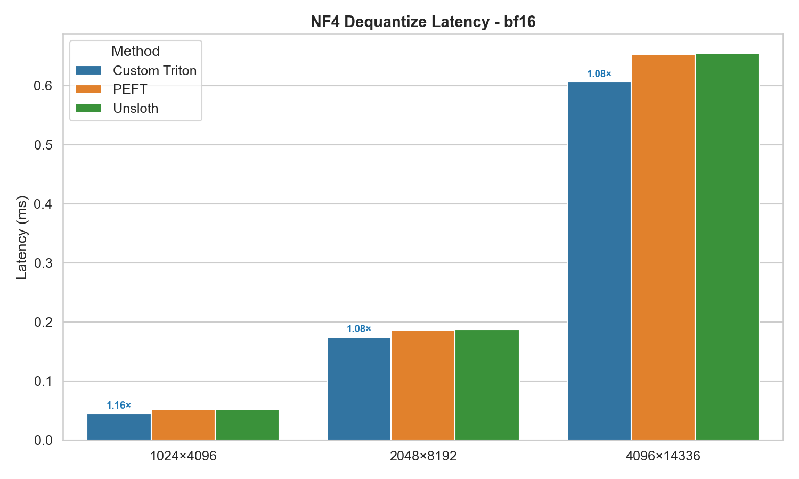

# NF4 Dequantize Kernel

A custom Triton kernel for dequantizing NF4 (4-bit NormalFloat) quantized weights, benchmarked against [Unsloth](https://github.com/unslothai/unsloth) and [PEFT](https://github.com/huggingface/peft) implementations.

## Performance

| GPU | Speedup vs Unsloth |
|-----|-------------------|
| T4  | 1.3x              |
| L4  | 1.15x             |

## Usage

```bash
uv run main.py
```

## Benchmark Results

